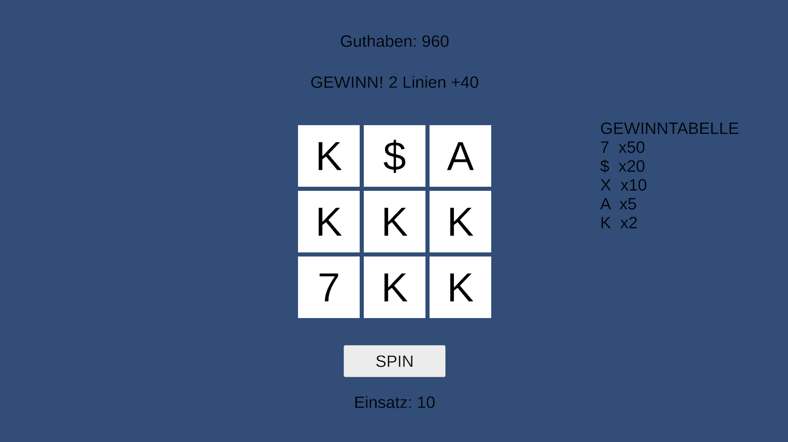

# 🎰 SlotMachine

A 3×3 slot machine game built from scratch in Unity, with a clean separation between game logic and presentation.

**▶ [Play it in your browser](https://paulus1701.itch.io/slot)** — no download needed.

## About

SlotMachine is a classic casino-style slot built in Unity (C#). Spin the reels across a 3×3 grid, match symbols on any of five paylines, and win payouts based on each symbol's value. Built as a learning project with a focus on clean, testable code architecture.

## Features

- **3×3 reel grid** with **5 paylines** (3 rows + 2 diagonals)
- **Weighted symbol probabilities** — rare symbols appear less often and pay more
- **Per-symbol multipliers** from a single paytable, used for both the payout math and the on-screen paytable
- **Balance & betting** system with a guard against overspending
- **Spin animation** built with Unity coroutines

## Architecture

The project deliberately separates **game logic** from **Unity / UI**:

- **SlotEngine** — a plain C# class with no Unity dependencies. It owns the symbols, the weighted paytable, the spin logic, payline evaluation, payouts, and the balance. Because it has no Unity dependency, it can be unit-tested in isolation.
- **GameController** — a thin MonoBehaviour that handles the button click, drives the spin animation, and translates the engine's result onto the UI. It contains no game rules.
- **Symbol** — a small data class bundling a symbol's name, weight (frequency), and multiplier.

This separation keeps the rules in one place, makes them testable, and lets the UI change without touching the logic.

## Tech

- **Unity 6.3 LTS** · **C#** · TextMeshPro

## Run locally

Play in the browser via the link above, or:

1. Clone this repo
2. Open the project in **Unity 6.3 LTS**
3. Open `Assets/Scenes/SlotMachine.unity` and press Play

## Roadmap

- Player-selectable bet amounts
- Symbol graphics instead of letters
- Winning-line highlight
- Gamble / risk-ladder feature
- Autospin, sound & polish
